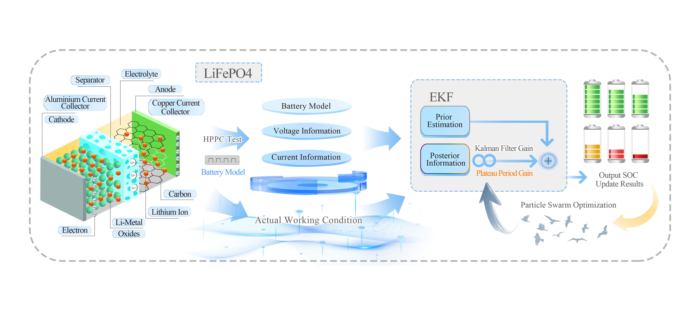
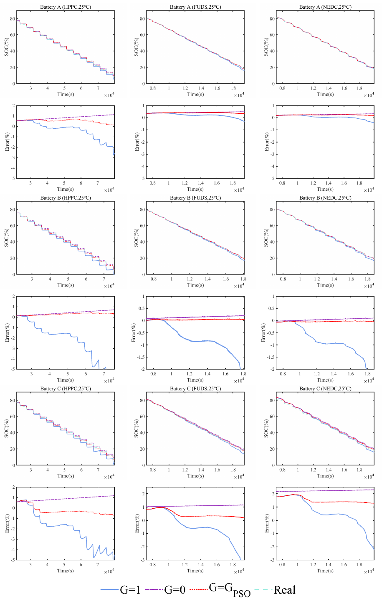

# PSO-EKF SOC Estimation v1.0.0

<div align="center">

**基于粒子群优化与扩展卡尔曼滤波的磷酸铁锂电池 SOC 估计实验**<br>
*Experimental data, Simulink models and results for PSO-assisted LiFePO₄ state-of-charge estimation*

[](NOTICE.md)

[快速开始](#快速开始) · [文档导航](#文档导航) · [更新日志](CHANGELOG.md)

</div>

<p align="center">
  
</p>

## 项目简介

本仓库是以下论文的实验配套项目，提供 **3 组电池、9 组工况数据、MATLAB/Simulink 模型、最终结果图和评价指标**。研究通过 PSO 确定 OCV 平台期增益，调节 EKF 对先验估计与电压观测的权重。

> Xihong Lu, Mingyang Chen, Yong Tian. **Accurate state-of-charge estimation of LiFePO4 battery: An adaptive extended kalman filter approach using particle swarm optimization.** *Energy Reports*, 14 (2025), 1169–1178. [DOI: 10.1016/j.egyr.2025.07.023](https://doi.org/10.1016/j.egyr.2025.07.023)

This repository accompanies the published paper and provides final experimental inputs, model implementations, figures and reported metrics. It covers three LiFePO₄ cells under HPPC, FUDS and NEDC conditions at 25 °C. See [reproduction notes](docs/reproduction.md) for the distinction between reported paper results and new simulation outputs.

## 主要特性

| 功能 | 说明 |
| --- | --- |
| 实验数据 | A、B、C 三组电池，HPPC / FUDS / NEDC 九组工况，共 405,207 条采样记录 |
| 通用格式 | MATLAB MAT 与 CSV 双格式，1 s 采样间隔，附字段、单位与电流方向说明 |
| OCV–SOC 数据 | 三组电池的最终 OCV–SOC 采样点 |
| 对比方法 | 标准 EKF（G=1）、平台期关闭更新（G=0）、PSO 平台期增益（G=G_PSO） |
| 模型 | PSO 增益估计、基础 EKF、二阶 RC 电压模型，原模型保存于 MATLAB R2023a |
| 最终结果 | 27 组 MAE/MSE 指标、结果预览及 EPS 矢量图 |
| 学术引用 | 正式论文 DOI、BibTeX 与 GitHub Citation 文件 |

论文报告的九组工况平均相对 MAE 降幅为 **27.64%**，MSE 降幅为 **39.24%**。各工况效果不同，完整表格与数值核对说明见 [实验结果](docs/results.md)。

<p align="center">
  
</p>

## 快速开始

1. 直接浏览 [最终指标表](results/tables/paper_metrics.csv) 和 [结果图目录](results/figures/README.md)。
2. 下载 [CSV 数据](data/csv/) 或 [MAT 数据](data/mat/)，按 [数据说明](docs/data.md) 导入。
3. 运行模型时，使用 MATLAB R2023a、Simulink 与 Stateflow，按 [快速开始](docs/getting-started.md) 配置实验。

模型重跑结果与论文报告值分别保存；运行要求、统计区间和验证范围见 [复现说明](docs/reproduction.md)。

## 目录结构

```text
.
├── src/models/              # 最终 Simulink 模型
├── scripts/                 # MATLAB 实验入口与数据检查
├── data/
│   ├── mat/                 # 模型输入与 OCV–SOC 数据
│   ├── csv/                 # 同一数值的通用格式
│   └── datasets.csv         # 数据组、采样数量与时间范围
├── results/
│   ├── tables/              # 论文报告指标和相对改进量
│   └── figures/             # PNG 预览、EPS 矢量图及索引
├── docs/                    # 使用、复现、结果与引用说明
├── licenses/                # 数据及第三方许可全文
├── CITATION.cff
├── NOTICE.md
├── checksums.sha256
├── README.md
├── CHANGELOG.md
├── VERSION
├── .gitignore
└── LICENSE
```

## 文档导航

| 文档 | 内容 |
| --- | --- |
| [文档索引](docs/README.md) | 全部阅读入口 |
| [快速开始](docs/getting-started.md) | 下载、导入与模型运行 |
| [数据说明](docs/data.md) | 数据组、单位、符号、时间轴与字段 |
| [复现说明](docs/reproduction.md) | 实验配置、统计窗口与结果边界 |
| [实验结果](docs/results.md) | 完整指标与解释 |
| [结果图目录](results/figures/README.md) | 各电池和工况的曲线、误差图 |
| [开发与验证](docs/development.md) | 已完成检查与运行验证范围 |
| [论文引用](docs/citation.md) | 论文链接、BibTeX 与引用方式 |
| [更新日志](CHANGELOG.md) | 公开版本内容 |

## 开发与验证

已核对数据数量、时间轴、CSV/MAT 数值一致性、模型依赖、结果表及公开文件内容。数据数组、模型算法和最终图形保留原有数值；文件中的本机路径及编辑者元数据已清理。

本次发布环境没有 MATLAB/Simulink，**尚未执行新增 MATLAB 入口的仿真验证**。论文报告指标随仓库独立提供，不将静态检查等同于数值复现。具体范围见 [开发与验证](docs/development.md)。

## 致谢

本研究获国家自然科学基金项目 **52477217** 支持，详见论文致谢。实验方法、数据与结论请引用上述论文。

本仓库的 README、文档与目录结构采用作者的 `github-repo-template` 统一模板，通过 Codex 技能维护。

## 许可证

代码与 Simulink 模型采用 [MIT](LICENSE)。实验数据、结果图表和说明文档采用 [CC BY 4.0](licenses/CC-BY-4.0.txt)，使用时应署名并标注修改。EPS 文件内的 Apache 绘图过程代码保留其原始许可，具体范围见 [许可说明](NOTICE.md)。
