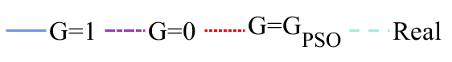

# 最终实验图

[返回项目首页](../../README.md) · [实验结果](../../docs/results.md)

本目录提供最终实验图的 PNG 预览和 EPS 矢量版本。图例沿用论文：蓝色为 G=1，紫色为 G=0，红色为 G=G_PSO，浅青色虚线为参考 SOC。

## SOC 估计与误差

| 电池 / 工况 | SOC 曲线 | 误差曲线 | 矢量图 |
| --- | --- | --- | --- |
| A / HPPC | [PNG](png/A_HPPC_P.png) | [PNG](png/A_HPPC_PE.png) | [SOC](eps/A_HPPC_P.eps) · [误差](eps/A_HPPC_PE.eps) |
| A / FUDS | [PNG](png/A_FUDS_P.png) | [PNG](png/A_FUDS_PE.png) | [SOC](eps/A_FUDS_P.eps) · [误差](eps/A_FUDS_PE.eps) |
| A / NEDC | [PNG](png/A_NEDC_P.png) | [PNG](png/A_NEDC_PE.png) | [SOC](eps/A_NEDC_P.eps) · [误差](eps/A_NEDC_PE.eps) |
| B / HPPC | [PNG](png/B_HPPC_P.png) | [PNG](png/B_HPPC_PE.png) | [SOC](eps/B_HPPC_P.eps) · [误差](eps/B_HPPC_PE.eps) |
| B / FUDS | [PNG](png/B_FUDS_P.png) | [PNG](png/B_FUDS_PE.png) | [SOC](eps/B_FUDS_P.eps) · [误差](eps/B_FUDS_PE.eps) |
| B / NEDC | [PNG](png/B_NEDC_P.png) | [PNG](png/B_NEDC_PE.png) | [SOC](eps/B_NEDC_P.eps) · [误差](eps/B_NEDC_PE.eps) |
| C / HPPC | [PNG](png/C_HPPC_P.png) | [PNG](png/C_HPPC_PE.png) | [SOC](eps/C_HPPC_P.eps) · [误差](eps/C_HPPC_PE.eps) |
| C / FUDS | [PNG](png/C_FUDS_P.png) | [PNG](png/C_FUDS_PE.png) | [SOC](eps/C_FUDS_P.eps) · [误差](eps/C_FUDS_PE.eps) |
| C / NEDC | [PNG](png/C_NEDC_P.png) | [PNG](png/C_NEDC_PE.png) | [SOC](eps/C_NEDC_P.eps) · [误差](eps/C_NEDC_PE.eps) |

## 电池数据与模型验证

| 电池 | HPPC 数据 | FUDS 数据 | NEDC 数据 | OCV–SOC | RC 模型 |
| --- | --- | --- | --- | --- | --- |
| A | [PNG](png/A_HPPC.png) | [PNG](png/A_FUDS.png) | [PNG](png/A_NEDC.png) | [PNG](png/A_OCV.png) | [PNG](png/A_RC.png) |
| B | [PNG](png/B_HPPC.png) | [PNG](png/B_FUDS.png) | [PNG](png/B_NEDC.png) | [PNG](png/B_OCV.png) | [PNG](png/B_RC.png) |
| C | [PNG](png/C_HPPC.png) | [PNG](png/C_FUDS.png) | [PNG](png/C_NEDC.png) | [PNG](png/C_OCV.png) | [PNG](png/C_RC.png) |

对应矢量版本位于 [eps/](eps/)，完整文件映射见 [index.csv](index.csv)。

## 方法验证图

- [不同平台期增益的误差比较](png/gtestb.png)
- [较小平台期增益的误差比较](png/g=0b.png)
- [PSO 目标函数的分布](png/pso_test.png)

最终方法示意见 [项目首页](../../README.md)。图片内容引用自配套论文和作者最终实验结果，使用许可为 [CC BY 4.0](../../NOTICE.md)。
